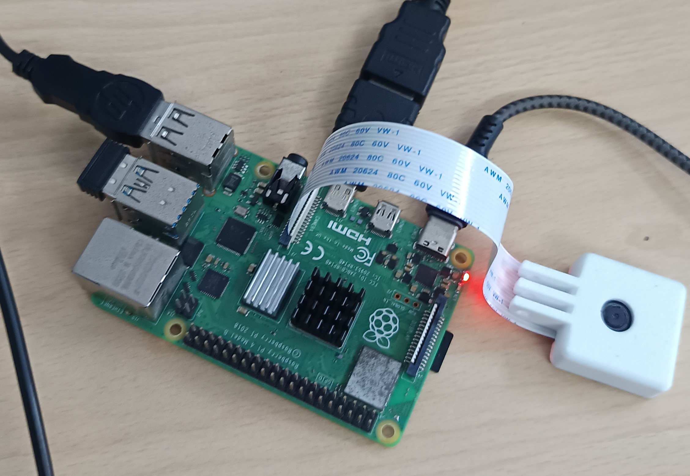
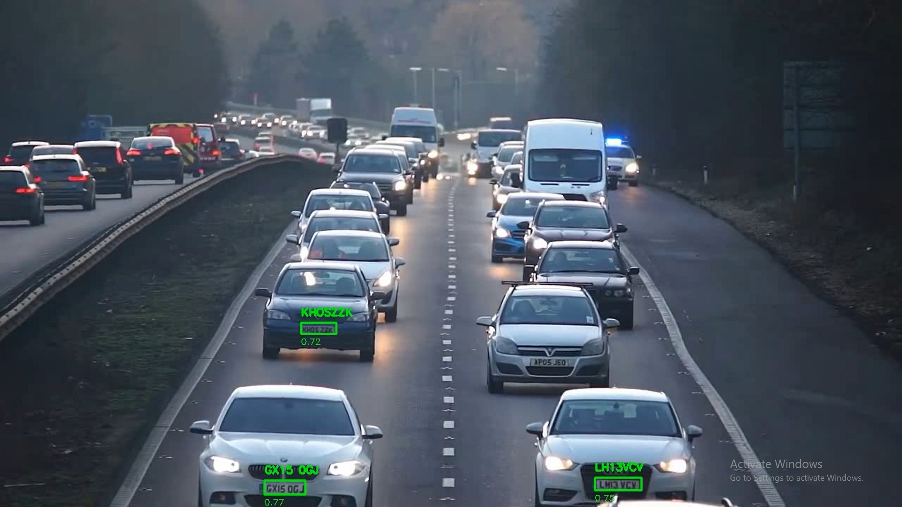
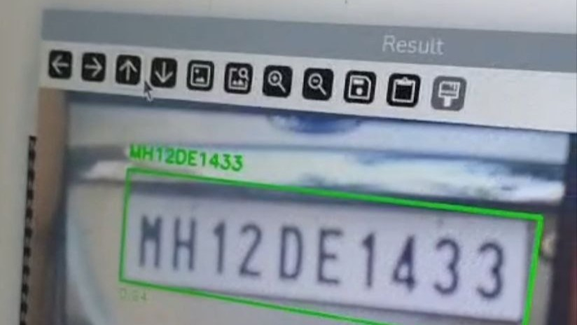

# Real-Time License Plate Detection and OCR using TensorFlow Lite, PaddleOCR, and Raspberry Pi

[](https://www.python.org/)
[](https://www.tensorflow.org/lite)
[](https://opencv.org/)
[](https://github.com/PaddlePaddle/PaddleOCR)
[](https://numpy.org/)
[](https://www.raspberrypi.com/)

---

# Overview

A real-time License Plate Detection and Recognition system built using:

- TensorFlow Lite
- PaddleOCR
- OpenCV
- Raspberry Pi Camera
- Computer Vision

The system captures live video from a Raspberry Pi camera, detects vehicle license plates using a TensorFlow Lite object detection model, performs perspective correction, and extracts plate text using PaddleOCR.

The project is optimized to run completely on CPU and is designed for edge deployment on Raspberry Pi 4 (64-bit).

---

# Features

✔ Real-time License Plate Detection  
✔ TensorFlow Lite Inference  
✔ PaddleOCR Text Recognition  
✔ Perspective Transformation  
✔ License Plate Rectification  
✔ OCR Text Extraction  
✔ Confidence Filtering  
✔ Non-Maximum Suppression (NMS)  
✔ Raspberry Pi Camera Integration  
✔ Live Visualization  
✔ CPU Optimized Execution  
✔ Thread Limiting for Stability  

---

# System Architecture

```text
Raspberry Pi Camera
        ↓
Frame Capture
        ↓
Preprocessing
        ↓
TensorFlow Lite Detection
        ↓
Bounding Box Extraction
        ↓
NMS Filtering
        ↓
Perspective Transform
        ↓
PaddleOCR
        ↓
License Plate Text
        ↓
Visualization
```

---

# Technologies Used

- Python
- TensorFlow Lite
- PaddleOCR
- PaddlePaddle
- OpenCV
- NumPy
- Raspberry Pi Camera (Picamera2)

---

# Project Workflow

## Phase 1 — Live Camera Acquisition

Capture frames continuously using Raspberry Pi Camera.

Output:

- RGB Frame

---

## Phase 2 — Object Detection

Run TensorFlow Lite model.

Outputs:

- Center X
- Center Y
- Width
- Height
- Confidence

---

## Phase 3 — Post Processing

Apply:

- Confidence Threshold
- Bounding Box Conversion
- NMS

Result:

Final License Plate Regions

---

## Phase 4 — Perspective Correction

Apply:

- Contour Extraction
- Rectangle Detection
- Perspective Transform

Output:

Straightened License Plate

---

## Phase 5 — OCR

Run PaddleOCR.

Extract:

- Characters
- Numbers
- Complete Plate Text

---

## Phase 6 — Visualization

Display:

- Bounding Box
- Confidence
- Extracted Text

---

# Folder Structure

```text
LicensePlateDetection/
│
├── models/
│   └── best_float32.tflite
│
├── src/
│   └── main.py
│
├── requirements.txt
├── description.md
├── README.md
│
└── outputs/
```

---

# Project Outputs

## Raspberry Pi Deployment Setup

<table>
<tr>

<td align="center">
        
</td>

<td align="center">
               
</td>

</tr>
</table>

<p align="center">
Live execution of the License Plate Recognition system on Raspberry Pi
</p>

---

## Real-Time License Plate Detection and OCR

<table>
<tr>

<td align="center">
        
        <p align=center>Output Processed in Linux/Windows Computer</p>
</td>

<td align="center">
        
        <p align=center>Raspberry Pi 4 Output</p>
</td>

</tr>
</table>

<p align="center">
Detected license plate with confidence score and extracted OCR text
</p>

---


# Installation

Clone repository

```bash
git clone https://github.com/YOUR_USERNAME/license-plate-detection-raspberrypi.git
```

Create environment

```bash
python -m venv cv_env
source cv_env/bin/activate
```

Install dependencies

```bash
pip install -r requirements.txt
```

Run

```bash
python main.py
```

---

# Controls

| Key | Action |
|------|--------|
| Q | Quit |

---

# Concepts Used

- TensorFlow Lite
- OCR
- Perspective Transform
- Object Detection
- Non Maximum Suppression
- Computer Vision
- Edge AI
- Real-Time Processing

---

# Future Improvements

- Multi-Line Plate Recognition
- Vehicle Tracking
- Database Integration
- Automatic Gate Control
- Edge TPU Acceleration
- Web Dashboard

---

# Applications

- Smart Parking
- Vehicle Monitoring
- Toll Automation
- Security Systems
- Automated Entry Systems

---

# Author

Abhivridh

B.Tech Computer Science Engineering

College of Engineering Trivandrum

⭐ Star this repository if you found it useful.
