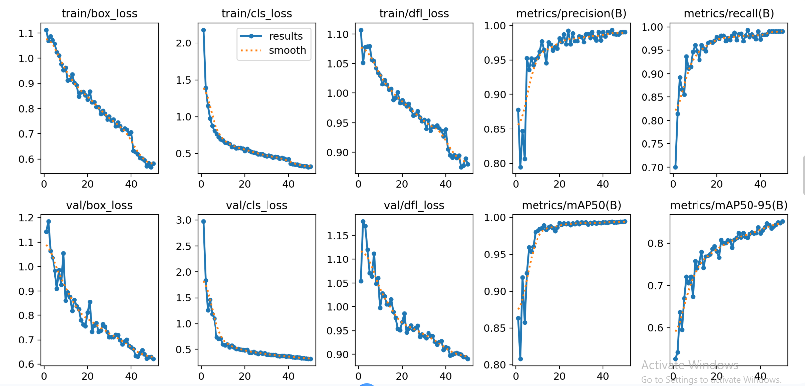

# Indian License Plate Detection Model Training and TensorFlow Lite Conversion

[](https://www.python.org/)
[]
[]
[]
[]
[]

---

# Overview

A complete training pipeline for building a **custom Indian License Plate Detection model** using **YOLOv8**, evaluating performance, and exporting the trained detector into **TensorFlow Lite (.tflite)** format for deployment on lightweight edge devices.

Pipeline:

```text
Dataset
↓
YOLOv8 Training
↓
Evaluation
↓
Best Model Selection
↓
TensorFlow Lite Conversion
↓
Deployment
```

---

# Model Performance

## 🚀 Final Evaluation Results

| Metric | Train | Validation | Test |
|:---|:---:|:---:|:---:|
| **mAP@50** | **99.40%** | **99.45%** | **98.99%** |
| **mAP@50–95** | **88.32%** | **85.13%** | **82.63%** |
| **Precision** | **99.31%** | **99.08%** | **99.28%** |
| **Recall** | **99.74%** | **99.04%** | **99.39%** |

---
# Results

## Learning Curves and Metrics

<table>

<tr>

<td align="center">



</td>

</tr>

</table>

<p align="center">
Training metrics automatically generated by YOLOv8
</p>

---

### 📌 Performance Summary

✅ Near-perfect detection accuracy (**~99% mAP@50**)  
✅ Strong generalization across validation and test sets  
✅ High precision with minimal false positives  
✅ Consistent recall for reliable license plate detection  


---

# Features

✔ Custom YOLOv8 Training
✔ Indian License Plate Dataset
✔ TensorFlow Lite Export
✔ GPU Accelerated Training
✔ Automatic Evaluation
✔ Edge AI Optimization
✔ Lightweight Deployment

---

# Dataset

Dataset Source:

Roboflow

Target Class:

```text
License Plate
```

Dataset Preparation:

* Annotation
* Train Split
* Validation Split
* Test Split

---

# Technologies Used

* Python
* YOLOv8
* TensorFlow
* TensorFlow Lite
* Ultralytics
* Roboflow
* PyTorch
* Google Colab

---

# Project Workflow

## Phase 1 — Dataset Acquisition

Download dataset.

Output:

```text
Indian-License-Plate-1/
```

---

## Phase 2 — Environment Setup

Install:

```bash
pip install ultralytics roboflow tensorflow
```

Verify GPU.

Output:

```text
GPU available
GPU name
```

---

## Phase 3 — YOLOv8 Training

Load pretrained model.

```python
model = YOLO("yolov8n.pt")
```

Train.

Parameters:

* Epochs → 50
* Batch → 16
* Image Size → 640
* Patience → 10

Output:

```text
best.pt
```

---

## Phase 4 — Evaluation

Measure:

* mAP@50
* mAP@50–95
* Precision
* Recall

Output:

```text
Performance Metrics
```

---

## Phase 5 — TensorFlow Lite Conversion

Convert model.

```python
trained_model.export(
format="tflite",
imgsz=640
)
```

Output:

```text
best_float32.tflite
```

---

# Folder Structure

```text
LicensePlateModelTraining/
│
├── notebooks/
│   ├── License Plate Recognition.ipynb
│   └── License Plate TFLite Conversion.ipynb
│
├── dataset/
│
├── runs/
│
├── models/
│   ├── best.pt
│   └── best_float32.tflite
│
├── assets/
│   ├── results.png
│   ├── train_batch.jpg
│   └── val_batch.jpg
│
└── README.md
```

---

# Outputs

Generated Files:

```text
best.pt
best_float32.tflite
results.png
```

---

# Applications

* Smart Parking
* Vehicle Monitoring
* Traffic Analytics
* Toll Systems
* Automatic Gate Systems

---

# Future Improvements

* Quantized TFLite
* Edge TPU Deployment
* Larger Dataset
* Multi-Class Vehicle Detection

---

# Author

Abhivridh

B.Tech Computer Science Engineering

College of Engineering Trivandrum

⭐ Star this repository if you found it useful.
